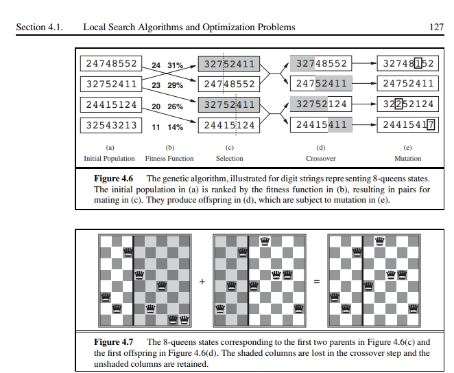

# Week 4 Task

This repository contains implementations of various optimization problems using Genetic Algorithms. Each folder corresponds to a specific problem and includes relevant implementations and examples.

## Resourse that I used

- [Russell & Norvig: Artificial Intelligence - A Modern Approach](https://people.engr.tamu.edu/guni/csce421/files/AI_Russell_Norvig.pdf) (Page 145-146)
- 
- As always git copilot to generet documentation and comment
  

## Folder Structure

```
week4-task/
│
├── travers-selse-man/
│   ├── TSM_example.py
│   ├── traverse_selse-genetic.py
│   └── traverse_selse_DP.py
│
├── job-shop-schedule/
│   ├── JSS_Example.py
│   └── job_shop_genetic.py
│
│
├── n-queens/
|    ├── N_queens_Example.py
|    ├── n_queens_genetic.py
|    └── n_queens_backtrac.py
|
├──genetic_algorithm.py
├──main.py
└──README.md

```

## Problem Descriptions

### 1. Traveling Salesman Problem (TSP)

The Traveling Salesman Problem aims to find the shortest possible route that visits a list of cities and returns to the origin city. The `tsp_genetic.py` file contains the implementation of a genetic algorithm designed to solve this problem.

### 2. Job Shop Scheduling

The Job Shop Scheduling problem involves scheduling a set of jobs on machines where each job consists of a sequence of tasks that need to be completed in a specific order. The `job_shop_genetic.py` file provides the implementation of the genetic algorithm for this scheduling problem.

### 3. N-Queens Problem

The N-Queens problem is a classic puzzle where the goal is to place N queens on an N×N chessboard such that no two queens threaten each other. The `n_queens_genetic.py` file includes the genetic algorithm implementation to find solutions to this problem.

## How to Run

1. Navigate to Genetic Algorithm folder
2. run main.py file which is an entery point for algorithms

`Uncomment the problem you want to run in the main.py file`

## Requirements

Make sure you have the following Python packages installed:

- `numpy`
- `random`

# Genetic Algorithm Components in Specific Problems

## 1. Traveling Salesman Problem (TSP)

- **Crossover**:

  - **Method Used**: **Partially Mapped Crossover (PMX)**.
  - **Explanation**: PMX helps maintain the order of cities and ensures that offspring do not have repeated cities, thus preserving valid paths.

- **Mutation**:

  - **Method Used**: **Swap Mutation**.
  - **Explanation**: This method randomly swaps two cities in the tour, allowing for the exploration of different paths and maintaining diversity in the population.

- **Selection**:
  - **Method Used**: **Tournament Selection**.
  - **Explanation**: This method selects a subset of individuals and chooses the best among them, favoring those with higher fitness while promoting diversity.

---

## 2. Job-Shop Scheduling (JSS)

- **Crossover**:

  - **Method Used**: **Order Crossover**.
  - **Explanation**: This method mixes jobs between parents while preserving the order of tasks, ensuring valid job schedules that respect the original sequences.

- **Mutation**:

  - **Method Used**: **Task Swap Mutation**.
  - **Explanation**: Randomly swapping two tasks in the schedule introduces variability and helps in finding better solutions while maintaining the overall structure of the job.

- **Selection**:
  - **Method Used**: **Rank Selection**.
  - **Explanation**: Individuals are ranked based on their fitness, allowing for a selection process that promotes diversity and prevents premature convergence.

---

## 3. N-Queens Problem

- **Crossover**:

  - **Method Used**: **One-Point Crossover**.
  - **Explanation**: This method allows for the exchange of sections of two parent solutions (board configurations), ensuring that no two queens occupy the same row in the resulting offspring.

- **Mutation**:

  - **Method Used**: **Random Queen Movement**.
  - **Explanation**: A queen is randomly moved to another row within the same column, helping explore new board configurations that may lead to valid solutions.

- **Selection**:
  - **Method Used**: **Roulette Wheel Selection**.
  - **Explanation**: This method selects individuals based on their fitness proportionally, allowing fitter solutions a higher chance of passing their traits to the next generation.

---

## Summary of Genetic Algorithm Components Used

- **Elitism**: Preserved the best individuals across generations in all three problems.
- **Selection**:
  - TSP: **Tournament Selection**
  - JSS: **Rank Selection**
  - N-Queens: **Roulette Wheel Selection**
- **Crossover**:
  - TSP: **Partially Mapped Crossover (PMX)**
  - JSS: **Order Crossover**
  - N-Queens: **One-Point Crossover**
- **Mutation**:
  - TSP: **Swap Mutation**
  - JSS: **Task Swap Mutation**
  - N-Queens: **Random Queen Movement**

These implementations reflect the specific choices made in your previous code, focusing on maintaining solution validity and promoting diversity throughout the genetic algorithm process.
