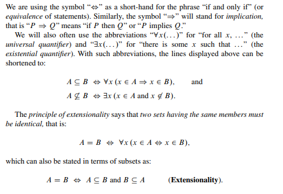
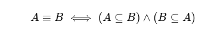

# MeTTa Nondeterminism Exercise

This project contains several `.metta` files, each defining various functions and tests. Below is a description of each file and the functions they contain.

# Resourse that I used

1. [Set Theory With an Introduction to Real Point Sets by Abhijit Dasgupta](https://link.springer.com/book/10.1007/978-1-4614-8854-5)

Example image about equvalence from the book page 3

# `Set Operations Formulas`

Let's first discuss how the set operations (complement, symmetric difference, subset, equivalent) relate to the existing ones defined in the built-in MeTTa.

## 1. Complement

The complement of set A with respect to the universal set U:

- I am assuming that U going to be a SPACE in metta

`we can relate complement with substraction `

## 2. Symmetric Difference

The symmetric difference of sets

`we can relate Symmetric Difference with substraction and union `

## 3. Subset

`we can relate Subset with substraction `

## 4. Equivalent

Two sets A and B are equivalent if:

`we can relate Equvalent with Subset `

# `File structure and content of each file`

## file1.metta

### Functions

- **compliment**

  - **Description**: Computes the complement of a set of atoms in the space.
  - **Parameters**:
    - `$space`: The space containing the atoms.
    - `$atoms`: The set of atoms to find the complement of.
  - **Returns**: List of atoms

- **symmetric-difference**

  - **Description**: Computes the symmetric difference between two sets of atoms.
  - **Parameters**:
    - `$set1`: The first set of atoms.
    - `$set2`: The second set of atoms.
  - **Returns**: List of atoms

- **subset**

  - **Description**: Checks if one set of atoms is a subset of another.
  - **Parameters**:
    - `$set1`: The first set of atoms.
    - `$set2`: The second set of atoms.
  - **Returns**: Boolean

- **equivalent**
  - **Description**: Checks if two sets of atoms are equivalent.
  - **Parameters**:
    - `$set1`: The first set of atoms.
    - `$set2`: The second set of atoms.
  - **Returns**: Boolean

### Tests

- `!(add-atom (get-space) B)`
- `!(add-atom (get-space) C)`
- `!(add-atom (get-space) D)`
- `!(add-atom (get-space) E)`
- `!(get-atoms (get-space))`
- `!(compliment (get-space) (superpose (A B C)))`
- `!(symmetric-difference (superpose (A B C F)) (superpose (A B C D E)))`
- `!(subset (superpose (A B C F)) (superpose (A B C D E)))`
- `!(equivalent (superpose (A B C)) (superpose (A B C)))`

## file2.metta

### Functions

- **wrapper**

  - **Description**: Applies a predicate to an atom and returns the atom if the predicate is true, otherwise returns an empty expression.
  - **Parameters**:
    - `$predicate`: A function that takes an atom and returns a boolean value.
    - `$x`: The atom to which the predicate is applied.
  - **Returns**: Expression

- **filter**
  - **Description**: Filters elements of a list based on a given predicate.
  - **Parameters**:
    - `$predicate`: The predicate function to apply to each element of the list.
    - `$list`: The list of elements to be filtered.
  - **Returns**: List

### Tests

- `(= (predicate $x) (> $x 0))`
- `!(filter predicate (1 -1 -2 3 4))`

## file3.metta

### Functions

- **any''**
  - **Description**: An optimized function that checks if any element in a list is true, stopping early if a true element is found.
  - **Parameters**:
    - `$x`: The list of elements.
    - `$acc`: The accumulator to store the result.
  - **Returns**: Boolean

### Tests

- `!(any'' (True False False False False) False)`

## file4.metta

### Functions

- **is-member**
  - **Description**: Checks if a given element is a member of a list.
  - **Parameters**:
    - `$element`: The element to check for membership in the list.
    - `$list`: The list in which to check for the element.
  - **Returns**: Boolean

### Tests

- `!(is-member 1 (2 1 3 4))`
- `!(is-member 1 (2 3 4))`

## file5.metta

### Functions

- **add-atoms-nd**
  - **Description**: Non-deterministically adds multiple atoms into the space at once.
  - **Parameters**:
    - `$space`: The space to which the atoms are added.
    - `$atoms`: The atoms to be added.
  - **Returns**: None

### Tests

- `!(add-reduct &self (= (get-space) (new-space)))`
- `!(add-atoms-nd (get-space) (A B C D E))`
- `!(get-atoms (get-space))`

## file5and6.metta

This file combines exercises 5 and 6 into a single document.

### Functions

- **add-atoms-nd**

  - **Description**: Non-deterministically adds multiple atoms into the space at once.
  - **Parameters**:
    - `$space`: The space to which the atoms are added.
    - `$atoms`: The atoms to be added.
  - **Returns**: None

- **remove-atoms-nd**
  - **Description**: Non-deterministically removes multiple atoms from the space.
  - **Parameters**:
    - `$space`: The space from which the atoms are removed.
    - `$atoms`: The atoms to be removed.
  - **Returns**: None

### Tests

- `!(add-reduct &self (= (get-space) (new-space)))`
- `!(add-atoms-nd (get-space) (A B C D E))`
- `!(get-atoms (get-space))`
- `!(remove-atoms-nd (get-space) (A B C D E))`
- `!(get-atoms (get-space))`

## file6.metta

### Functions

- **remove-atoms-nd**
  - **Description**: Non-deterministically removes multiple atoms from the space.
  - **Parameters**:
    - `$space`: The space from which the atoms are removed.
    - `$atoms`: The atoms to be removed.
  - **Returns**: None

### Tests

- `!(add-reduct &self (= (get-space) (new-space)))`
- `!(add-atoms-nd (get-space) (A B C D E))`
- `!(get-atoms (get-space))`
