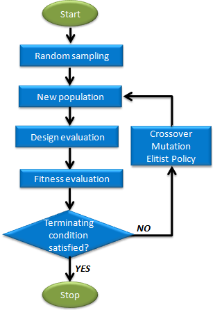
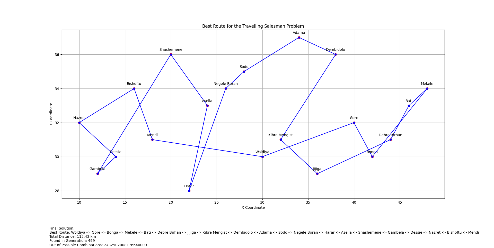

Here’s a concise yet comprehensive README file in Markdown format for your project:


# Genetic Algorithm Solver for Travelling Salesman, N-Queens, and Job Shop Scheduling

## Project Overview
This project implements three classic optimization problems—**Travelling Salesman**, **N-Queens**, and **Job Shop Scheduling**—using **Genetic Algorithms (GA)**. Each problem is solved by evolving a population of candidate solutions over several generations, with the goal of finding an optimal or near-optimal solution.

## What are Genetic Algorithms?
Genetic Algorithms (GA) are search heuristics based on the principles of natural selection and genetics. They are typically used to solve optimization problems where traditional methods may be inefficient. GAs operate by evolving a population of candidate solutions over time, applying techniques like **selection**, **crossover**, and **mutation** to progressively improve the solutions.

### Key Concepts in Genetic Algorithms:
1. **Population**: A set of candidate solutions.
2. **Genome/Chromosome**: A representation of a solution, typically encoded as a string or array.
3. **Fitness Function**: A function that evaluates how good a solution is.
4. **Selection**: The process of choosing better solutions to produce the next generation.
5. **Crossover**: Combining two solutions to create offspring.
6. **Mutation**: Introducing random changes to a solution to maintain diversity in the population.

### Genetic Algorithm Workflow (Pseudocode):
```
1. Initialize a random population of solutions.
2. Evaluate the fitness of each solution.
3. While the stopping condition is not met:
    a. Select parents based on fitness.
    b. Perform crossover to create new offspring.
    c. Apply mutation to offspring.
    d. Evaluate the fitness of new solutions.
    e. Replace old population with the new population.
4. Return the best solution found.
```

One of the most crucial steps in GAs is the **REPRESENTATION** of the problem. The way a solution is encoded (its genome) determines how easy it is to apply genetic operators (crossover, mutation) and evaluate its fitness.



---

## Problem 1: Travelling Salesman Problem (TSP)
In the Travelling Salesman Problem, the goal is to find the shortest route that visits a set of cities exactly once and returns to the starting point. Each genome represents an ordered list of cities, and the fitness function evaluates the total distance traveled.

### Representation:
The genome is represented as a permutation of city indices:
```python
# Example data representation for cities
cities = [
    City("City1", x=10, y=20),
    City("City2", x=15, y=25),
    City("City3", x=5, y=10)
]
# Genome: [0, 1, 2] means visit City1 -> City2 -> City3
```
### Fitness Function:
The fitness function calculates the total distance of the tour:
```python
def fitness(order: Genome, cities: List[City]) -> float:
    return sum(get_distance(cities[order[i]], cities[order[i + 1]]) for i in range(len(order) - 1))
```

---

## Problem 2: N-Queens Problem
In the N-Queens Problem, the goal is to place `N` queens on an `N x N` chessboard so that no two queens threaten each other. The genome represents the row positions of queens in each column.

### Representation:
Each genome is a list of integers where each index represents a column and the value is the row:
```python
# Genome: [0, 2, 4, 1, 3] means:
# - Queen 1 in (row 0, col 0)
# - Queen 2 in (row 2, col 1)
# - etc.
```
### Fitness Function:
The fitness function counts the number of non-attacking pairs of queens:
```python
def fitness(genome: Genome) -> int:
    non_attacking = 0
    # Check rows and diagonals for conflicts...
    return total_conflicts  # Lower values are better
```

---

## Problem 3: Job Shop Scheduling Problem
In the Job Shop Scheduling Problem, multiple jobs need to be processed on different machines, with each job having specific operations that need to be scheduled. The goal is to minimize the makespan (total time) of all jobs while respecting machine constraints.

### Representation:
The genome represents the start times and machine assignments for each operation:
```python
# Genome: [start_time_1, machine_1, start_time_2, machine_2, ...]
# Example: [0, 1, 5, 2] means:
# - Operation 1 starts at time 0 on machine 1
# - Operation 2 starts at time 5 on machine 2
```
### Fitness Function:
The fitness function calculates the makespan and applies penalties for constraint violations:
```python
def fitness(genome: Genome, data: List) -> int:
    makespan = 0
    fouls = 0
    # Calculate total processing time and penalize fouls...
    return makespan + fouls * 1000  # Lower is better
```

---
